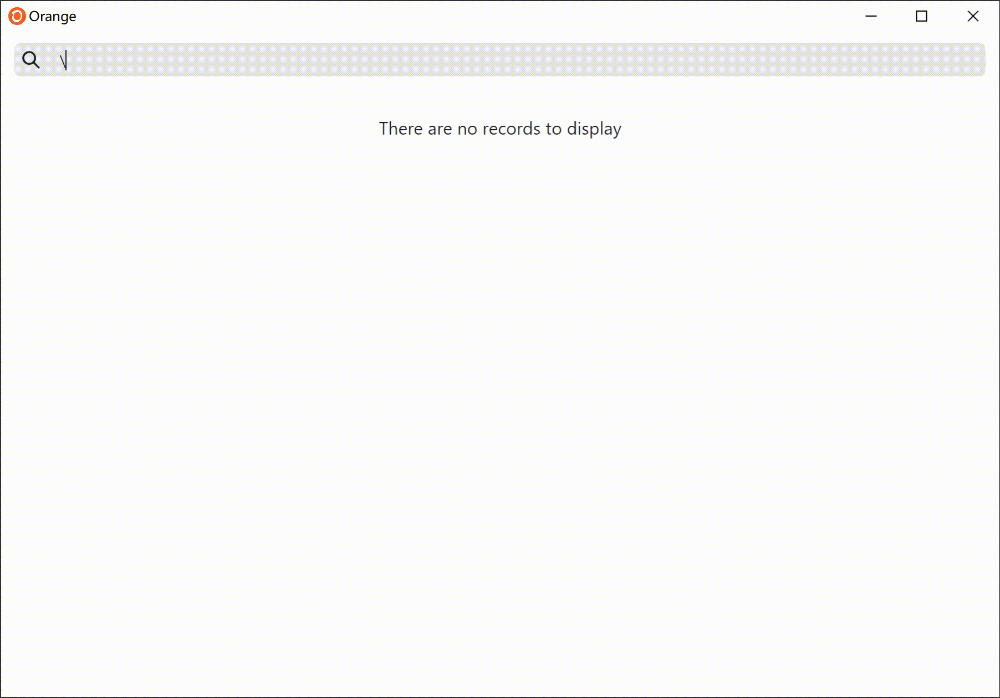
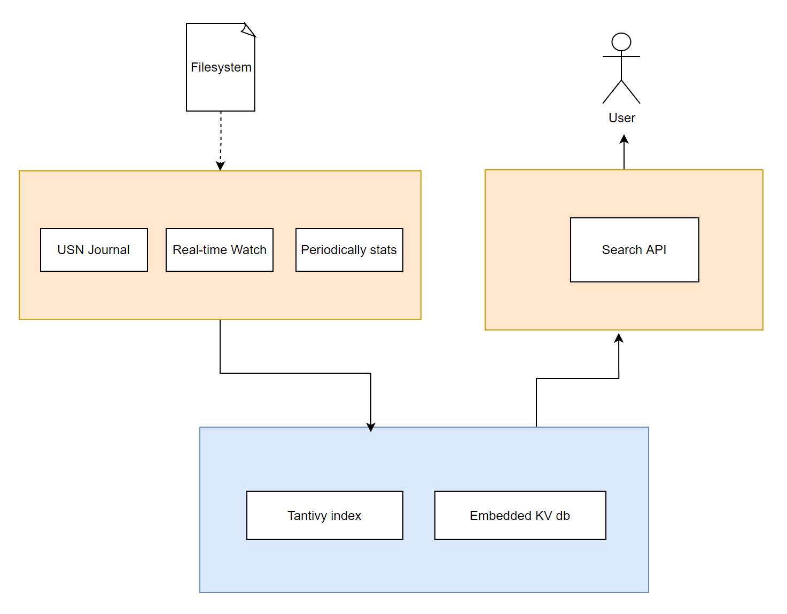

English
 | 
<a href="README_cn.md">中文</a>

A cross-platform desktop application for searching local files.

 

## What is Orange?

Orange is a **file search** desktop application. 

## ✨Features

- Fast search response
- Low memory and low cpu usage
- Easy to use, comes with tokenization and auto completion
- Monitor file changes in real time
- Lightweight installation package
- Simple and elegant UI

## Build 
- Setup Tauri dev environment (https://tauri.studio/docs/getting-started/setting-up-macos)
- Run `yarn`
- Run `yarn build`
- Run `yarn tauri-build`

## Download

Go to [release page](https://github.com/naaive/orange/releases).

## Notice

If you are Macos user, after install, please run `xattr -cr /Applications/Orange.app` to fix `“Orange” is damaged and can’t be opened. You should move it to the Trash.`

## Architecture

## Thanks
- Tauri https://tauri.studio
- Notify https://github.com/notify-rs/notify
- React https://github.com/facebook/react
- Tantivy https://github.com/quickwit-oss/tantivy
- Kv https://github.com/zshipko/rust-kv

## LICENSE

[GPL](https://github.com/naaive/orange/blob/master/LICENSE)

